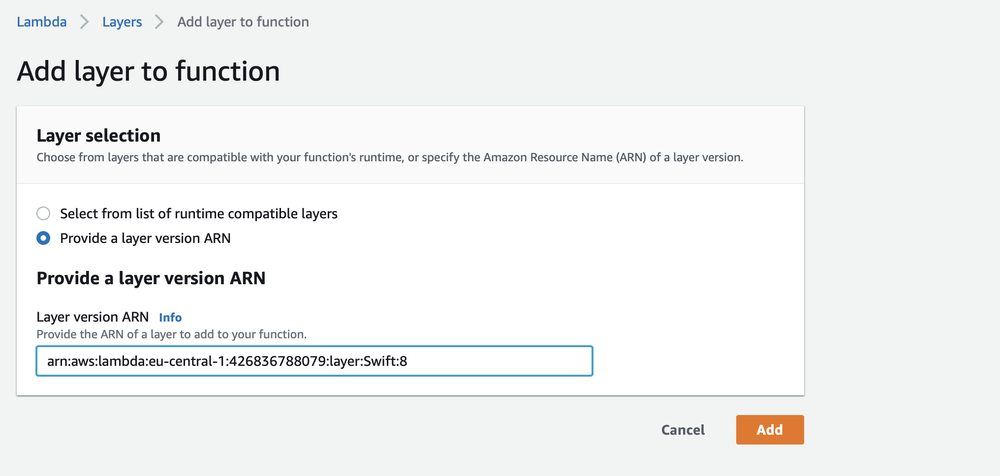
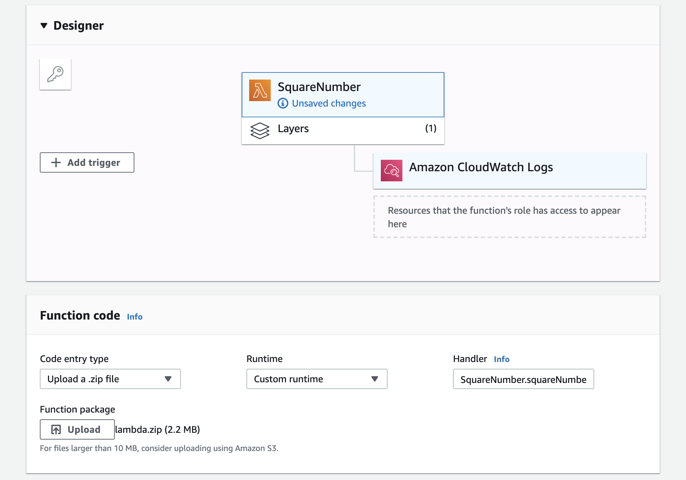

# swift-lambda-runtime

[](https://swift.org/download/)
[](https://github.com/fabianfett/swift-lambda-runtime/actions)
[](https://codecov.io/gh/fabianfett/swift-lambda-runtime)

An AWS Lambda Swift runtime on top of SwiftNIO with some ready-to-use AWS Events. It is intended to be used with the [Swift on Amazon Linux](https://fabianfett.de/amazonlinux-swift) project which ensures that Swift executables can be run on Amazon Linux.

An APIGateway Lambda looks like this:

```swift
import LambdaRuntime
import NIO

let group = MultiThreadedEventLoopGroup(numberOfThreads: 1)
defer { try! group.syncShutdownGracefully() }

struct Input: Codable {
  let name: String
}

struct Greeting: Codable {
  let greeting: String
}

let handler = APIGateway.handler() { (request, ctx) in
  do {
    let payload = try request.decodeBody(Input.self)

    let response = try APIGateway.Response(
      statusCode: .ok,
      payload: Greeting(greeting: "Hello \(payload.name)"))
  
    return ctx.eventLoop.makeSucceededFuture(response)
  }
  catch {
    return ctx.eventLoop.makeFailedFuture(error)
  }
}

let runtime = try Runtime.createRuntime(eventLoopGroup: group, handler: handler)
defer { try! runtime.syncShutdown() }
try runtime.start().wait()
```

If you want to run your [Vapor](https://github.com/vapor/vapor) app on Lambda behind an APIGateway please checkout [`vapor-lambda-runtime`](https://github.com/fabianfett/vapor-lambda-runtime), which builds on top of this package.

## Status

- [x] Runs natively on Amazon Linux and links against system libraries. Uses the Lambda Layer created by the [`amazonlinux-swift`](https://github.com/fabianfett/amazonlinux-swift) project.
- [x] Built on top of `Swift-NIO`
- [x] Integration with Swift [`Logging`](https://github.com/apple/swift-log)
- [x] Ready-to-use [AWS Events](https://github.com/fabianfett/swift-lambda-runtime/tree/master/Sources/LambdaRuntime/Events) structs to get started as fast as possible. Currently implemented: Application Load Balancer, APIGateway, Cloudwatch Scheduled Events, DynamoDB Streams, S3, SNS and SQS Messages. More coming soon.
- [x] [Tested integration](https://github.com/fabianfett/swift-lambda-runtime/blob/master/Examples/TodoAPIGateway/Sources/TodoAPIGateway/main.swift) with [`aws-swift-sdk`](https://github.com/swift-aws/aws-sdk-swift)
- [x] [Two examples](https://github.com/fabianfett/swift-lambda-runtime/tree/master/Examples) to get you up and running as fast as possible (including an [API-Gateway Todo-List](http://todobackend.com/client/index.html?https://mwpixnkbzj.execute-api.eu-central-1.amazonaws.com/test/todos))
- [x] Unit and end-to-end tests
- [x] CI workflow with GitHub Actions

Alternatives: There is another project to run Swift within AWS-Lambda: [Swift-Sprinter](https://github.com/swift-sprinter/aws-lambda-swift-sprinter). 


## Create and run your first Swift Lambda

This should help you to get started with Swift on AWS Lambda. The focus is primarily on the AWS console, since it is the easiest way to begin with. Of course you can use the [aws-cli](https://aws.amazon.com/cli/), [sam-cli](https://docs.aws.amazon.com/serverless-application-model/latest/developerguide/serverless-sam-cli-layers.html), the [serverless-framework](https://serverless.com/framework/docs/providers/aws/guide/layers/), [cloudformation](https://aws.amazon.com/cloudformation/) or whatever tooling you prefer at every step of your way. I even encourage you to do so in a production environment. Noone likes clicky architectures. 🤯 If you are looking for an example, check out the [sam-template](https://github.com/fabianfett/swift-lambda-runtime/blob/master/Examples/TodoAPIGateway/template.yaml) in the [TodoBackend](https://github.com/fabianfett/swift-lambda-runtime/tree/master/Examples/TodoAPIGateway) example.

*Note: The following instructions were recorded on 19.12.2019 and the GUI may have changed since then. Feel free to start an issue if you see a different one.*

The Swift version used here is `5.2.1`. You can look up available versions of Swift on Amazonlinux [here](https://fabianfett.de/amazonlinux-swift). You may want to use a later version if that works for you!

### Step 1: Develop your lambda

Create a new Swift Package Manager project. For simplicity reasons we will focus solely on squaring numbers with our Lambda function.

```bash
$ mkdir SquareNumbers
$ cd SquareNumbers
$ swift package init --type executable
```

The easiest way to go forward from here is to drag the newly created `Package.swift` onto Xcode to open the Swift package in Xcode.

Next, we will need to include the `LambdaRuntime` and `SwiftNIO` as dependencies. For that open the `Package.swift` and modify it so that it looks like this:

```swift
// swift-tools-version:5.2
// The swift-tools-version declares the minimum version of Swift required to build this package.

import PackageDescription

let package = Package(
  name: "SquareNumber",
  dependencies: [
    .package(url: "https://github.com/fabianfett/swift-lambda-runtime.git", .upToNextMajor(from: "0.2.0")),
    .package(url: "https://github.com/apple/swift-nio", .upToNextMajor(from: "2.0.0")),
  ],
  targets: [
    .target(
      name: "SquareNumber",
      dependencies: [
        .product(name: "LambdaRuntime", package: "swift-lambda-runtime"),
        .product(name: "NIO", package: "swift-nio"),
      ]
    ),
  ]
)
```

Then open your `main.swift` and create your function. As mentioned earlier, in this example we just want to square numbers although your function can do whatever you want.

```swift
import LambdaRuntime
import NIO

struct Input: Codable {
  let number: Double
}

struct Output: Codable {
  let result: Double
}

func squareNumber(input: Input, context: Context) -> EventLoopFuture<Output> {
  let squaredNumber = input.number * input.number
  return context.eventLoop.makeSucceededFuture(Output(result: squaredNumber))
}

let group = MultiThreadedEventLoopGroup(numberOfThreads: 1)
defer { try! group.syncShutdownGracefully() }

do {
  let runtime = try Runtime.createRuntime(
    eventLoopGroup: group, 
    handler: Runtime.codable(squareNumber))

  defer { try! runtime.syncShutdown() }
  
  try runtime.start().wait()
}
catch {
  print("\(error)")
}
```

### Step 3: Built your lambda

Your lambda needs to be built for the Amazon Linux environment. For that we use Docker to compile the Lambda. Please be aware that you need to use the same Swift version for compiling your lambda as you will use for running it. [ABI Stability is not a thing on Linux](https://swift.org/blog/abi-stability-and-more/).

For this we will first need to build a development Docker image in order to compile your code on Linux. Create a Docker file and include the following code:

```Dockerfile
ARG SWIFT_VERSION=5.0
FROM fabianfett/amazonlinux-swift:$SWIFT_VERSION-amazonlinux2

# needed to do again after FROM due to docker limitation
ARG SWIFT_VERSION

RUN yum -y update && \
  yum -y install zlib-devel kernel-devel gcc-c++ openssl-devel
``` 

To create your Docker image run:

```bash
docker build --build-arg SWIFT_VERSION=5.2.1 -t lambda-swift-dev:5.2.1 .
```

Now we can compile our lambda with the new image.

```bash
# build your lambda in the linux environment 
$ docker run --rm --volume "$(pwd)/:/src" --workdir "/src/" lambda-swift-dev:5.2.1 swift build -c release
```

This will create a `SquareNumber` executable in your `./build/release` folder. Let's grab the executable and rename it to `bootstrap`.

```bash
# copy your executable to your local folder and rename it to bootstrap
$ cp .build/release/$(EXAMPLE_EXECUTABLE) ./bootstrap
```

Last: We need to zip the bootstrap before uploading to AWS.

```bash
# zip your bootstrap
$ zip -j lambda.zip ./bootstrap
```

### Step 4: Create your lambda on AWS

Open your AWS Console and navigate to [Lambda](https://console.aws.amazon.com/lambda/home). Select "Functions" in the side navigation and click on "Create function" in the upper right corner. Give your function a name. I'll choose "SquareNumbers" and select the runtime "Provide your own bootstrap".

You'll see a screen that looks like this.


First we need to select our Swift runtime. We do so by clicking "Layers" below the function name in the center of the screen. The lower part of the screen changes and we can see an "Add Layer" button in the center. Let's click that button. On the next screen we need to select "Provide a layer version ARN" and there we enter the ARN that fits the Swift version that we've used to compile. For Swift `5.2.1` this is `arn:aws:lambda:<region>:426836788079:layer:Swift:12`. Do not forget to replace `<region>` with the AWS region identifier you operate in. Next we click "Add".



Now you should see a layer below our function. Next we click on the function name. You should see the section "Function Code" in the lower part of the screen. Select "Upload a zip file" in the "Code entry type". Click on "Upload" and select your `lambda.zip`. In the "Handler" field you can fill in whatever you want (at least one character), since this field is not used by our runtime‌. Next click "Save".



### Step 5: Invoke your lambda

The only thing left is to invoke your lambda. Select "Test" (in the upper right corner) and change your test payload to whatever json you want to supply to your function. Since I want numbers squared mine is as follows: 

```json
{
  "number": 3
}
```

Since AWS wants to reuse your event for tests over and over again, you need to give your test event a name. Mine is "Number3". Click "Save" and you can click "Test" again, and this time your lambda will be execute. If everything went well, you should see a screen like this:


## What's next?

Great! You've made it so far. In my point of view, you should now familiarize yourself with some tooling around AWS Lambda.

### Lambda deployment/testing tooling

It may be serverless or aws-sam, as noone wants or should build Lambda services by just clicking around in the AWS Console. The TodoList example is [setup with aws-sam](https://github.com/fabianfett/swift-lambda-runtime/blob/master/Examples/TodoAPIGateway/template.yaml). If you need more help about how to get started with aws-sam, please reach out by opening a GitHub issue.

### aws-sdk

There are two projects providing you an API to interact with AWS resources.

- [`aws-sdk-swift`](https://github.com/swift-aws/aws-sdk-swift) A community driven effort. The [TodoList example](https://github.com/fabianfett/swift-lambda-runtime/tree/master/Examples/TodoAPIGateway) uses this sdk to [query DynamoDB](https://github.com/fabianfett/swift-lambda-runtime/blob/master/Examples/TodoAPIGateway/Sources/TodoService/DynamoTodoStore.swift).
- [`smoke-aws`](https://github.com/amzn/smoke-aws) An Amazon (not AWS 😉) driven effort. Please be aware that this sdk does not return `EventLoopFuture`s. Therefore integrating may be a little tricky. Not tested.

### Logging 

If you want to log something inside your lambda you can use the [`logger` property](https://github.com/fabianfett/swift-lambda-runtime/blob/master/Sources/LambdaRuntime/Context.swift#L15) on the `Context` class. The `logger` is based on [`swift-log`](https://github.com/apple/swift-log) and should for this reason be compatible with lot's of other server-side Swift projects. By default the [RequestId is exposed](https://github.com/fabianfett/swift-lambda-runtime/blob/master/Sources/LambdaRuntime/Context.swift#L21) as metadata. An example can be found [here](https://github.com/fabianfett/swift-lambda-runtime/blob/master/Examples/URLRequestWithSession/Sources/URLRequestWithSession/main.swift).

### EventLoop

The EventLoop, on which your function is executed, can be accessed via the [`eventLoop` property](https://github.com/fabianfett/swift-lambda-runtime/blob/master/Sources/LambdaRuntime/Context.swift#L16) on the `Context` class. An example can be found [here](https://github.com/fabianfett/swift-lambda-runtime/blob/master/Examples/URLRequestWithSession/Sources/URLRequestWithSession/main.swift).

## Contributing

Please feel welcome and encouraged to contribute to swift-lambda-runtime. The current version of swift-lambda-runtime has a long way to go before being ready for production use and help is always welcome.

If you've found a bug, have a suggestion or need help getting started, please open an Issue or a PR. If you use this package, I'd be grateful for sharing your experience.

Focus areas for the time being:
- Implementing [all aws lambda resource events](https://github.com/aws/aws-lambda-go/tree/master/events). Those should be quite easy for a first PR. Just grab one and go!
- Fixing all the bugs and performance bottlenecks of the first release.

## Credits

- [Toni Suter](https://github.com/tonisuter/aws-lambda-swift) started the project to bring Swift to AWS Lambda.
- [grpc-swift](https://github.com/grpc/grpc-swift) influenced how the `Logger` and `EventLoop` are exposed to the user using the `Context`.
